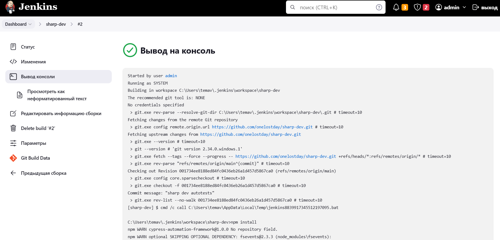
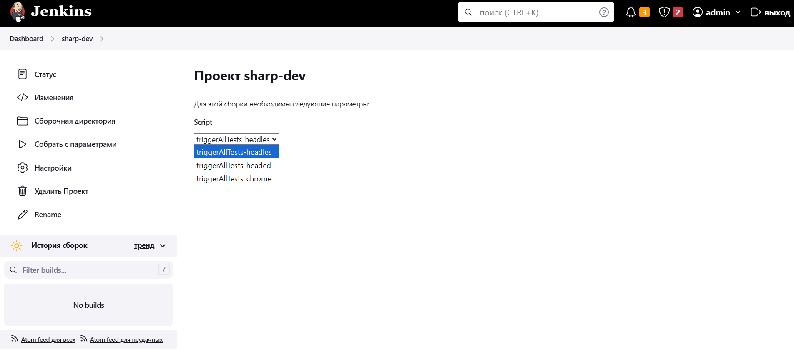
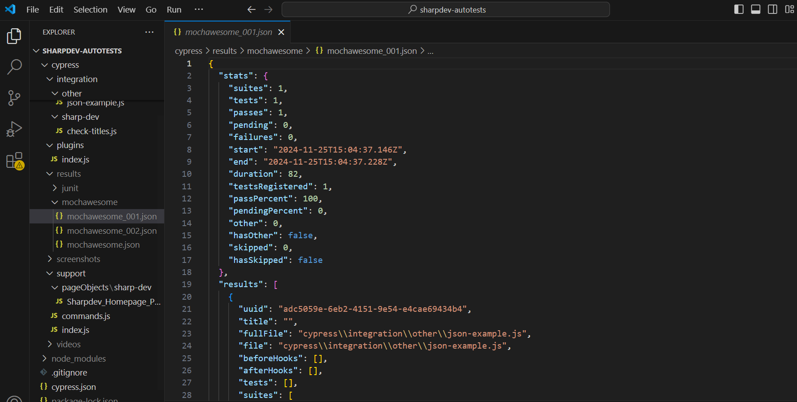

# Testing automation project for sharp dev

## :pushpin: Content:

- [Technologies and tools](#earth_africa-Technologies-and-tools)
- [Implemented checks](#earth_africa-Implemented-checks)
- [Build parameters in Jenkins](#earth_africa-Build-parameters-in-Jenkins)
- [Launching from the terminal](#earth_africa-Launching-from-the-terminal)
- [MochaAwesome report](#earth_africa-MochaAwesome-report)

## :rocket: Technologies and tools

<p align="center">
<a href="https://code.visualstudio.com/"></a>
<a href="https://www.java.com/"></a>
<a href="https://github.com/"></a>
<a href="https://junit.org/junit5/"></a>
<a href="https://www.jenkins.io/"></a>
<a href="https://www.jenkins.io/"></a>
</p>

## :scroll: Implemented checks

- ✓ Checking the learn more button.
- ✓ Click on the learn more button and enter Software Development page.
- ✓ Checking title pricing.
- ✓ Checking and validating contact us form.

## Jenkins job

<a></a>

<a></a>

</p>

### Build parameters in Jenkins:

- triggerAllTests-headless (npx cypress run)
- triggerAllTests-headed (npx cypress run --headed)
- triggerAllTests-chrome (npx cypress run --browser chrome)

## :computer: Launching from the terminal

Local launch:

```bash
npm run triggerAllTests-headless
```

Remote launch:

```bash
npm run %Script%
```

## MochaAwesome <a>report</a>

### Основное окно

<p align="center">

</p>
